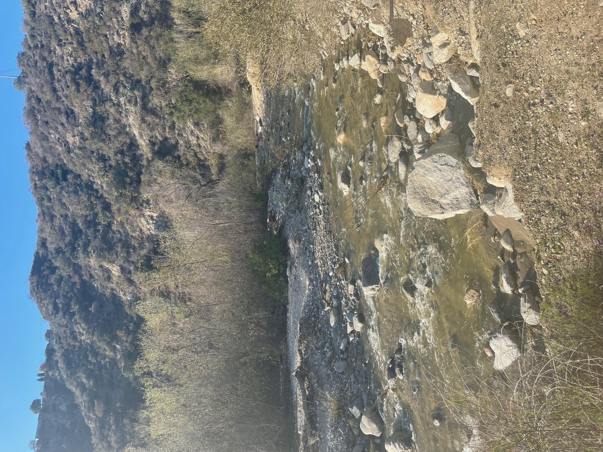

::::::::::: darkgrey-text
## Bridging Ecology and Data Science

I grew up five minutes from the Arroyo Seco in Pasadena, on the land of the Hahamog'na people, where I spent a lot of time watching urban wildlife navigate a riparian habitat hemmed in by golf courses and invasive species. That tension between nature and human activity never left me, and it's shaped everything I've done since.

:::: column-margin

```{r}
#| echo: false
#| out-width: 800%
#| fig-alt: "A shallow rocky creek flowing through a dry chaparral canyon with shrubs and hills in the background, North Arroyo Seco, Pasadena, CA.."

```

::: figure-caption
North Arroyo Seco, Pasadena, CA
:::
::::

I completed my B.S. in Ecology & Evolution with a Spatial Studies minor at UC Santa Barbara, and I'm currently pursuing a Master of Environmental Data Science at the Bren School. My work sits at the intersection of ecology, genomics, and data science, I'm interested in how we can use computational tools to better understand and protect wildlife in a human-dominated world.

For my Master's capstone, I'm collaborating with the National Center for Ecological Analysis and Synthesis (NCEAS) to develop an R package that enables on-demand access to 250GB of western wildfire resilience data, building tools that make large, complex datasets more accessible for predictive modeling and risk assessment.

During my undergrad, I interned at the Smithsonian's Center for Conservation Genomics, working on the population genetics of endangered South American river otters in Chile. I also served as a research assistant in UCSB's Young Lab, and through the McNair Scholars Program, conducted independent research on how human activity shapes large mammal presence along the California coast 

I care deeply about turning science into action, and about making sure that science reflects and serves all communities. Outside the lab and field, I stay engaged through mentorship, outreach, and organizations like SACNAS and MESA.

